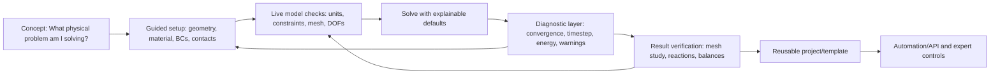
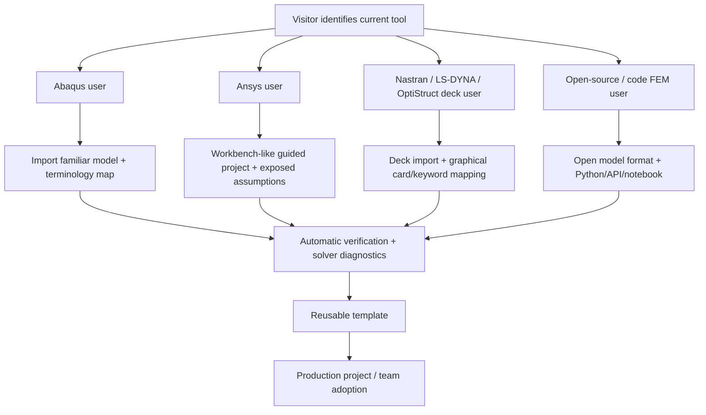

# FEM Learning Ecosystem Research: Abaqus and Competing Simulation Platforms

## Executive summary

The FEM learning market is unusually attractive for a new competing product because the incumbent software ecosystems are mature, technically deep, and heavily documented, yet users still repeatedly struggle at the same transitions: **turning theory into a correct model, choosing elements and mesh strategy, defining contact and nonlinear controls, diagnosing nonconvergence, understanding opaque solver messages, automating repetitive work, and translating a tutorial model into a production-quality analysis**. This gap appears even in the strongest learning ecosystems. Ansys users explicitly complain that following examples can feel like copying steps rather than learning how to make modeling decisions; Abaqus users repeatedly seek help with convergence, meshing, user-subroutine toolchains, and interpretation of model setup; Code_Aster users describe being overwhelmed by documentation despite the solver's capabilities. citeturn2search28turn12search3turn16search4turn9search16

**Abaqus, Ansys Mechanical, and COMSOL have the strongest overall learning ecosystems.** Abaqus has an unusually valuable combination of a self-paced official “Getting Started with Abaqus/CAE,” a large documentation collection, example/benchmark problems, a free Learning Edition, formal SIMULIA training, third-party courses, and a large body of community video content. citeturn17search0turn17search2turn22search23turn14search6 Ansys has extensive step-by-step Mechanical tutorials, a large free Innovation Space course library, academic curriculum resources, community forums, and a commercial Learning Hub with more than 300 courses. citeturn18search9turn14search10turn18search13turn14search25 COMSOL is particularly strong at converting documentation into accessible learning: its Learning Center combines self-guided video courses with targeted articles, while its Model Gallery offers more than 1,000 downloadable examples. citeturn14search8turn4view1turn19search31

The next tier—**LS-DYNA, Nastran, and Altair HyperWorks/OptiStruct**—has excellent expert material but presents more fragmentation between solver documentation, preprocessing, specialized workflows, and institutional knowledge. LS-DYNA compensates with unusually rich official examples, manuals, training, and working-group materials. citeturn6search2turn6search14turn6search26turn2search1 Nastran learning is divided between solver-deck concepts and pre/post environments such as Patran, Femap, and Simcenter 3D; advanced Siemens courses still explicitly teach topics such as DMAP and nonlinear solution sequences, illustrating how much expertise lives below the GUI. citeturn20view0turn15search1turn15search4 Altair has a strong formal learning catalog around HyperMesh, OptiStruct, meshing, linear/nonlinear analysis, and structural optimization, but a community discussion illustrates an important competitive opening: a learner found it harder to reconstruct an analysis from HyperMesh's model tree than from Ansys Workbench and perceived Abaqus as having more approachable tutorials. citeturn6search1turn22search25turn22search29turn16search6

The **open-source segment has almost the inverse problem**. CalculiX, Code_Aster, Elmer, FEniCSx, OpenSees, FEBio, and OpenRadioss can offer powerful solvers, transparent formats, and low or zero licensing cost, but the end-to-end learning and usability experience is much less consistent. CalculiX deliberately uses an Abaqus-like input format and increasingly appears inside FreeCAD, PrePoMax, and other CAE workflows. citeturn23search3turn23search19 Code_Aster has substantial verification depth and training material but recurring community complaints about terminology, workflow complexity, documentation language, and Salome-Meca setup. citeturn9search0turn9search4turn9search16 FEniCSx is an exception in educational design: its official ecosystem strongly embraces Python and Jupyter notebooks, making it an excellent benchmark for an interactive, code-native learning mode. citeturn21search0turn21search8turn21search16

For a competing product, the strongest opportunity is therefore **not simply “make FEM easier.”** It is to create an environment that retains expert visibility and control while making every modeling decision explainable. A compelling differentiation would combine:

**guided modeling + explicit assumptions + live verification + solver diagnostics + editable templates + automation + open interchange formats.**

That positioning addresses both sides of the market. It gives Ansys/COMSOL users fewer opaque defaults while giving Abaqus/Nastran/LS-DYNA/open-source users less manual setup and less error-message archaeology. The evidence across official tutorials and forums suggests that users value step-by-step examples and videos for entry, but become dependent on searchable reference material, downloadable working models, error-specific troubleshooting, scripting, and templates as they progress. citeturn18search9turn19search31turn6search26turn17search6turn21search0

A key current-market consideration is that the ownership landscape itself is moving: Cadence completed its acquisition of Hexagon's Design & Engineering business, including MSC Nastran, in February 2026; Altair learning content is being migrated into Siemens Xcelerator Academy; and Ansys now operates under Synopsys. Those transitions create an additional moment in which users may be receptive to alternative workflows and migration tooling. citeturn15search0turn22search5turn22search9

## Market and learning-resource landscape

The following availability scores are an **analyst assessment**, not vendor market-share statistics. “User-base scale” is likewise qualitative because vendors generally do not publish comparable active-seat or active-user figures. Altair's community reports more than 1.3 million users, but that is a cross-product community metric and should not be interpreted as 1.3 million HyperWorks or OptiStruct users. citeturn13search3

| Platform | Learning-resource availability | User-base / ecosystem scale | Typical workflow | Strongest learning asset | Competitive opening |
|---|---:|---|---|---|---|
| **Abaqus / SIMULIA** | **5/5** | Very large industrial CAE ecosystem; particularly prominent in nonlinear structural mechanics | CAD/CAE → parts/assembly → materials → steps/interactions → mesh → Standard or Explicit → ODB results → Python/subroutines | Excellent official Getting Started material, deep reference manuals, examples/benchmarks, broad third-party teaching. citeturn17search0turn17search2turn14search6 | Convergence diagnostics, aging/complex CAE workflow, meshing edge cases, scripting/subroutine setup, licensing/platform complexity. citeturn12search20turn16search4turn16search6 |
| **Ansys Workbench / Mechanical** | **5/5** | Very large, cross-industry | Workbench project → Engineering Data → geometry → Mechanical tree → contacts/mesh/loads → solve → postprocessing; APDL/Python for deeper control | Very large free Innovation Space library plus highly structured official Mechanical tutorials and academic resources. citeturn18search9turn14search10turn18search13 | Users can get results quickly but may not understand defaults; meshing, licensing, convergence and the GUI/APDL boundary generate recurring questions. citeturn2search28turn12search16turn12search9turn12search28 |
| **COMSOL Multiphysics** | **5/5** | Large specialized multiphysics/science-engineering ecosystem; exact active users unspecified | Geometry → materials → physics interfaces → multiphysics couplings → mesh → study/solver → results → sweeps/optimization/apps/API | Probably the best integrated “learn by example” ecosystem: Learning Center, videos and 1,000+ downloadable models. citeturn14search8turn4view1turn19search31 | Nonlinear convergence, memory/DOF growth, solver settings and multiphysics complexity remain difficult; users need increasingly specific diagnostics as models grow. citeturn12search8turn12search2turn12search22 |
| **MSC Nastran + Patran** | **4/5** | Large but specialized; entrenched in aerospace, automotive and long-lived certification workflows | Preprocessor or hand-edited model → case control/bulk data → Nastran solution sequence → F06/OP2 → postprocessing | Very deep manuals and solver theory; durable deck-based knowledge. citeturn20view0turn7search0turn7search4 | Learning is fragmented across solver, deck syntax and pre/post tools; old models and debugging favor experts who understand the text deck. |
| **Simcenter Nastran / Simcenter 3D** | **4/5** | Large specialist Siemens CAE ecosystem | CAD/Simcenter 3D → FE idealization → solution sequence → solve/postprocess; Femap also common with Nastran workflows | Structured Siemens training from introductory FEA through nonlinear and DMAP customization. citeturn15search1turn15search4turn15search9 | Same expert/deck gap as Nastran generally; excellent candidate for modern model-tree, deck-diff and solver-explanation tooling. |
| **LS-DYNA** | **4.5/5** | Large specialist crash, impact, forming, defense and nonlinear dynamics ecosystem | Geometry/mesh → LS-PrePost or other preprocessor → keyword deck → explicit/implicit solve → D3plot/time histories → postprocess | Exceptionally rich official examples, tutorials, manuals, knowledge-center content and industry working groups. citeturn6search2turn6search14turn6search26turn2search1 | Keyword complexity, contact/material setup, timestep/mass scaling, failure models and output volume create a steep jump from “runs” to “trustworthy.” |
| **HyperWorks / HyperMesh / OptiStruct** | **4.5/5** | Very large CAE/preprocessing/optimization ecosystem; Altair community reports >1.3M cross-product users. citeturn13search3 | CAD cleanup → HyperMesh idealization/meshing → solver profile → OptiStruct deck → solve → HyperView; topology/size/shape optimization common | Strong structured e-learning and live curricula for meshing, linear/nonlinear analysis and optimization. citeturn6search1turn22search25turn22search29 | Model discoverability and reconstructability, GUI transition costs, and the separation between preprocessing concepts and solver concepts. citeturn16search6 |
| **CalculiX** | **3.5/5** | Meaningful open-source/industrial niche | CAD/mesh via FreeCAD, PrePoMax, CGX, etc. → Abaqus-like `.inp` → CCX → FRD/postprocess | Familiar syntax for Abaqus users, official manual/test cases, active Discourse community. citeturn23search3turn23search31 | Integrated pre/post UX, installation/packaging, compatibility confidence and polished diagnostics. Its use through FreeCAD/PrePoMax illustrates demand for a better front end. citeturn23search19 |
| **Code_Aster / Salome-Meca** | **3.5/5 overall; ~3/5 English onboarding** | Strong engineering/open-source niche backed by EDF | Salome geometry/mesh → AsterStudy command model → Code_Aster → MED/ParaVis | Deep verification corpus, official training and serious structural/mechanical capabilities. citeturn9search0turn9search3turn23search14 | Steep terminology/workflow learning curve, documentation accessibility, shell/contact issues, installation and postprocessing complaints. citeturn9search4turn9search16turn9search18turn9search23 |
| **Elmer FEM** | **3/5** | Specialized research/multiphysics/open-source community | Mesh → ElmerGUI or text configuration → solver → postprocessing; parallel/HPC possible | Extensive manuals/tutorials and an official GitHub-centered ecosystem. citeturn8search2turn8search5turn8search11 | The material is deep but less productized into a progressive beginner journey; opportunity for integrated GUI and example discovery. |
| **FEniCSx** | **4.5/5 for code-oriented learners** | Large academic/computational-science niche | Define variational problem in Python/UFL → mesh/function spaces → assemble/solve → Python visualization/HPC | Jupyter-first tutorials and excellent computational-mechanics numerical tours. citeturn21search0turn21search8turn21search16 | Poor fit for users expecting a full CAE GUI, but excellent benchmark for transparent, programmable and interactive FEM education. |
| **OpenSees / OpenSeesPy** | **4/5 in civil/seismic** | Strong structural/earthquake-engineering research and professional niche | Tcl/Python model → nodes/elements/materials → analysis algorithm/integrator → recorders/results | Long-standing Berkeley/PEER docs plus basic-to-advanced examples. citeturn21search1turn21search5turn21search9 | Scripting and nonlinear-analysis configuration create barriers for GUI-centric users; rich opportunity for templates and visual model validation. |
| **FEBio** | **3.5/5** | Important biomechanics/soft-tissue niche | FEBio Studio → mesh/material/contact → nonlinear solve → biomedical postprocessing | Domain-specific biomechanics focus, academic teaching material and Studio webinars. citeturn21search30turn21search2turn21search14 | Specialist constitutive/contact workflows benefit from domain-specific templates and validation guidance. |
| **OpenRadioss** | **3.5/5 and improving** | Emerging open-source explicit-dynamics ecosystem backed by an industry-proven solver lineage | Open preprocessor or commercial HyperMesh → Radioss deck → engine → converters/ParaView | Open code plus ModelExchange example library and GitHub discussions. citeturn21search3turn21search7turn21search27 | Users explicitly ask how to perform the entire CAD-to-mesh-to-BC workflow using only open-source tooling, exposing a major frontend gap. citeturn21search15turn21search31 |

A particularly important distinction for product strategy is that **commercial incumbents tend to teach the software workflow first**, whereas code-oriented FEM systems such as FEniCSx tend to expose the mathematical formulation much more directly. FEniCSx's tutorials progress from Poisson problems through heat equations, nonlinear PDEs and coupled time-dependent systems, with Jupyter notebooks as a first-class format. citeturn21search0turn21search8 A new FEM product could combine both paradigms: a graphical CAE workflow for productivity, with an optional “show me the equations/model definition” view for trust and advanced learning.

The current Nastran ecosystem warrants one additional note. Cadence completed its acquisition of the former Hexagon Design & Engineering business on February 23, 2026, bringing MSC Nastran and Adams into Cadence; its announcement specifically describes these tools as important in aerospace and automotive and identifies major OEM users. citeturn15search0 Simcenter Nastran remains part of Siemens' distinct CAE ecosystem. For user acquisition, “Nastran users” should therefore be segmented by **solver lineage, pre/post environment, and model archive**, rather than treated as one homogeneous audience.

## Authoritative, community, and academic learning-resource map

The table below prioritizes official/primary English-language sources. “Academic” means directly university-hosted material where surfaced; where a strong public university course pack could not be confirmed, that is stated rather than substituting an unrelated tutorial.

| Tool | Authoritative official resources | Community / video / code resources | University and academic material |
|---|---|---|---|
| **Abaqus** | **Getting Started with Abaqus/CAE** is an official self-paced tutorial; the documentation collection includes CAE, Analysis, Benchmarks, constraints and other guides. The current SIMULIA training catalog spans introductory Abaqus, scripting, Explicit, contact and specialized subjects. The free **Abaqus Learning Edition** supports educational structural models up to 1,000 nodes and includes the HTML documentation. citeturn17search0turn17search2turn14search6turn22search23 | CAE Assistant has free beginner material and a large project/course catalog; YouTube contains practical examples including elastic-plastic modeling, concrete damage/failure, bolt pretension and Fortran/user-subroutine setup. `abqpy` provides a modern browsable interface to the Abaqus Python API documentation. citeturn14search18turn16search0turn16search5turn16search16turn17search11 | Rensselaer Polytechnic Institute's **MANE/CIVL 4240 Introduction to Finite Elements** Abaqus handout is a genuine university course resource. citeturn20view1 NTNU's **TMM4160 Fracture Mechanics** computational-exercise manual is an example of advanced Abaqus use in an engineering curriculum. citeturn20view2 |
| **Ansys Workbench / Mechanical** | The official **Mechanical Tutorials** are designed as complete, interactive step-by-step analyses. The Mechanical User's Guide supplies the reference layer. **Ansys Innovation Space** has free “Get Started with Ansys Mechanical,” theoretical FEA courses, application examples, and completion badges; the commercial Learning Hub advertises 300+ courses. citeturn18search9turn18search18turn14search10turn18search22turn14search25 | The Ansys Knowledge/Innovation Space forums contain solved model-specific questions and downloadable samples. Community YouTube playlists are abundant, though quality is variable; therefore a competitor should compete on verified models rather than volume alone. citeturn18search0turn18search3 | Ansys publishes educator materials itself. Its **Fundamentals of FEA Tutorial** was created with the University of Newcastle and covers CAD import, mesh, loads/BCs and first solve; the 1D FEA resource connects analytical and Ansys Mechanical solutions. citeturn18search13turn18search10 |
| **COMSOL Multiphysics** | The **Learning Center** is exceptionally comprehensive: Getting Started, UI, geometry, mesh, structural mechanics, flow, multiphysics coupling, convergence, API, GPU computing, model management and many specialist topics. The **Model Gallery/Application Gallery** provides more than 1,000 downloadable examples. The official Getting Started video series follows the full geometry→materials→physics→mesh→study→postprocess workflow. citeturn14search8turn4view1turn19search31 | COMSOL's own Discussion Forum is the main support/community venue, supplemented by a huge official video library. A substantial independent YouTube ecosystem also exists, including complete beginner playlists. citeturn4view3turn19search3turn19search27 | UMBC's transport course provides lecture material and multiple COMSOL tutorials; Purdue's multidisciplinary modeling course uses COMSOL alongside MATLAB and publishes online instructional material. citeturn10search28turn10search14 |
| **MSC Nastran / Patran** | The official **MSC Nastran Getting Started Guide** remains an important entry document; documentation sets include linear, thermal, HPC and specialist manuals. Cadence is now the corporate home of MSC Software after the 2026 acquisition. citeturn20view0turn7search4turn15search0 Patran remains the accompanying general-purpose pre/postprocessor. citeturn22search6 | SimCompanion/knowledge-base content and community videos provide task-specific explanations. Independent videos cover beginner static models and Nastran workflows, but the ecosystem is less consolidated than Ansys or COMSOL. citeturn7search8turn7search20 | MSC's academic program has historically provided student/professor access and educational exercises, including a Nastran/Patran Student Edition. citeturn7search28turn22search10 A broad, current, public English university course corpus comparable to Abaqus/Ansys was **not found** in this research. |
| **Simcenter Nastran / Simcenter 3D** | Siemens Xcelerator Academy provides formal learning tracks. Current catalog examples include advanced DMAP customization and nonlinear Solutions 401/402 using Simcenter 3D pre/post, with hands-on workshops and convergence debugging. citeturn15search1turn15search4turn15search9 | Siemens Community has Simcenter 3D knowledge-base tutorials; independent YouTube tutorials cover the basic preprocessing/solution workflow. citeturn7search3turn11search11 | Public university-hosted course material surfaced less consistently than for Abaqus/Ansys/COMSOL; **unspecified**. Siemens' own academy is the more reliable current curriculum source. |
| **LS-DYNA** | The official LS-DYNA site provides manuals, an **Examples Manual**, beginner tutorials, a Knowledge Center with basic/intermediate/advanced examples and mini-tutorials, and formal training. LS-PrePost has its own quick-start guidance. citeturn6search6turn6search2turn6search14turn6search26turn2search13 | The Aerospace Working Group publishes high-value test cases and modeling guidance; the LS-DYNA community/forum ecosystem is technically deep. citeturn2search1turn6search30 | Public university course packs are comparatively scattered; the most reusable high-level educational material is the official examples/working-group corpus. **Specific comprehensive English university sequence: unspecified.** |
| **HyperWorks / HyperMesh / OptiStruct** | The OptiStruct help includes interactive tutorials, User Guide, Reference Guide and Example Guide. Altair Learning has introductory OptiStruct, linear analysis, nonlinear analysis and optimization curricula; HyperMesh training teaches preprocessing/meshing plus OptiStruct linear static/modal workflows. citeturn6search20turn6search1turn6search29turn22search25turn22search29 | Altair/Siemens Community is large and includes discussions, shared resources and solver-specific expertise. citeturn13search3turn16search6 | Altair has historically invested heavily in academic learning, but a current independent university course corpus was not consistently surfaced in the research set. **Use Altair/Siemens learning resources as the authoritative curriculum baseline.** |
| **CalculiX** | The official CalculiX site and Dhondt documentation cover linear/nonlinear static, dynamic and thermal analysis. The manual/distribution contains numerous verification and example models; an older HTML example set illustrates cantilever, eigenfrequency, rotating components, thermal furnace, seepage, electrostatics and pipe-flow cases. citeturn23search3turn23search23turn8search7 | The **CalculiX Discourse** forum is the best community source; users share converted Abaqus examples, input decks and practical troubleshooting. citeturn23search31turn17search24 PrePoMax and FreeCAD integrations are important adjacent learning channels. citeturn23search19 | No large current English university course corpus surfaced. CalculiX frequently appears in open-source CAE and teaching projects, but a definitive university learning sequence is **unspecified**. |
| **Code_Aster / Salome-Meca** | EDF's Code_Aster site, Salome-Meca integration, and current official basic training cover geometry, meshing, modeling, calculation and postprocessing; the beginner course uses a perforated plate, pressurized cylinder and bent pipe. citeturn9search0turn9search3turn23search14 | The Code_Aster forums are especially useful because they document the real learning curve: users discuss long onboarding, shell orientations, shell/solid connections, English documentation, installation and the need for simpler tutorials. citeturn9search4turn9search16turn9search22 | Code_Aster originates in a research/industrial setting and is used educationally, but the public English university material is fragmented. The official training and forum-recommended tutorials are currently more discoverable. |
| **Elmer FEM** | The official Elmer GitHub organization contains solver, GUI, manuals and tutorials; project documentation runs to roughly 900 pages and covers structural, fluid, thermal, electromagnetic and coupled multiphysics problems. CSC provides binaries/documentation and support. citeturn8search2turn8search5turn8search14 | GitHub is effectively part of the core community workflow; examples and tutorials are bundled around the project. citeturn8search11 | University-specific English courses were not sufficiently surfaced to recommend a canonical sequence. **Unspecified.** |
| **FEniCSx** | Official FEniCS documentation points users to component docs and Jupyter tutorial programs. citeturn21search0 | Jørgen Dokken's FEniCSx tutorial and Jeremy Bleyer's **Numerical Tours of Computational Mechanics with FEniCSx** are unusually high-quality open educational resources. The FEniCS Discourse forum is active. citeturn21search8turn21search16turn21search28 | The ecosystem is inherently academic. Johns Hopkins hosts lab-level FEniCSx guidance, and the broader project is heavily embedded in computational-science education. citeturn21search20 |
| **OpenSees / OpenSeesPy** | Berkeley/PEER hosts OpenSees and its current documentation, including installation, command manual, examples and issue/feature-request guidance. The classic Advanced Examples collection ranges from single-element linear models to complex 3D nonlinear fiber models. citeturn21search1turn21search5turn21search9 | Beginner OpenSees videos and OpenSeesPy GitHub learning repos are abundant; a current example repository focuses on structural dynamics and earthquake engineering. citeturn21search17turn21search21 | Because OpenSees was developed through Berkeley/PEER for earthquake engineering, academic material is intrinsic to the ecosystem rather than a separate commercial training layer. citeturn21search1 |
| **FEBio** | FEBio is a freely available, extensible biomechanics FEM framework, and FEBio Studio is the integrated environment. citeturn21search30 | FEBio webinars show complete Studio workflows, while specialist tutorials exist around the GUI and biomechanical analyses. citeturn21search14turn21search33 | McGill's Auditory Mechanics Laboratory publishes FEBio guidance and explicitly recommends beginning with the Studio User Manual before its tutorials. citeturn21search2 |
| **OpenRadioss** | The official site links the solver and a library of example models; the GitHub organization includes the solver, tools and ModelExchange repository. citeturn21search3turn21search27 | GitHub Discussions is central. Questions explicitly cover how to create a fully open-source preprocessing stack and what to use for postprocessing; tools now include converters and a GUI launcher. citeturn21search15turn21search31turn21search34 | A canonical university course was not found. **Unspecified.** The project itself is currently the best source of examples. |

Several resources stand out as models for a competitor's own educational architecture.

**Abaqus's Getting Started tutorial** is good at introducing the conventional CAE sequence, but Abaqus then gives experts access to deep documentation, Python scripting, input files and user-defined routines. citeturn17search0turn17search6 **Ansys Mechanical's tutorial philosophy** is explicitly “complete step-by-step analysis procedure,” which is strong for task completion. citeturn18search9 **COMSOL's approach** is more granular and searchable: its Learning Center has separate pieces on nonlinear convergence, mesh refinement, solver setup, geometry manipulation, API use, model-file size, CAD integration, GPU selection and many application-specific subjects. citeturn14search8 **FEniCSx**, meanwhile, provides the strongest model for executable documentation. citeturn21search0turn21search8

For a new product, those should not be viewed as four competing educational styles. They can be combined into one system:

That progression matches the structure seen across official beginner curricula, advanced troubleshooting material and scripting/API documentation in Abaqus, Ansys and COMSOL. citeturn17search0turn18search9turn14search8

## Learning paths, example problems, and content formats

Across almost every ecosystem, the effective path is not “beginner → more buttons.” It is **simple physics → verification → nonlinearity → realism → automation**. Vendor curricula themselves reflect this progression: Siemens' Nastran training moves from introductory FEA toward nonlinear solution sequences and DMAP; Altair separates linear analysis, nonlinear analysis and structural optimization; SIMULIA offers introductory Abaqus followed by contact, Explicit, scripting and specialized courses. citeturn15search1turn15search4turn22search25turn22search29turn14search6

| Platform | Recommended beginner → advanced learning path | High-value example/project sequence |
|---|---|---|
| **Abaqus** | CAE navigation → linear static → element/mesh choice → contact → material nonlinearity → geometric nonlinearity → dynamics → Explicit → fracture/composites → scripting → UMAT/VUMAT/UEL | Cantilever or plate → hole/stress concentration → bolt pretension → two-body contact → plastic tensile/compression specimen → rubber/contact → modal/random vibration → impact/crash → concrete damage → fracture → parameterized Python model. Official and community resources cover many of these directly. citeturn17search0turn16search16turn16search0turn16search5turn16search11 |
| **Ansys Mechanical** | Workbench/Mechanical → static structural → mesh refinement → modal/thermal → contacts/bolts → nonlinear materials → buckling → transient → composites/fracture → APDL/Python automation | Beam/plate → bracket → preloaded bolted joint → modal structure → thermal stress → nonlinear contact → buckling/plasticity → delamination → dynamic response. Innovation Space already exposes examples such as cantilevers, bolted joints and cardiovascular stents. citeturn18search22turn18search27 |
| **COMSOL** | UI/workflow → one physics interface → mesh/study/result → parametric sweep → nonlinear model → coupled multiphysics → optimization/UQ → API/apps | Heat conduction → structural bracket → laminar flow → Joule heating → thermal stress → fluid-structure/electro-thermal-mechanical → optimization → simulation app. COMSOL explicitly teaches CAD import, mesh refinement and electro-thermal-mechanical workflows. citeturn14search8turn19search31 |
| **MSC/Simcenter Nastran** | FE fundamentals → BDF/case control → SOL 101 static → SOL 103 modes → SOL 105 buckling → linear dynamics → composites → aeroelasticity → nonlinear SOL 400/401/402 → DMAP | Beam/plate/solid → static bracket → mode extraction → buckling → frequency/transient response → composite laminate → contact/nonlinear material → custom output/DMAP. Siemens' advanced courses mirror this progression. citeturn20view0turn15search4turn15search1 |
| **LS-DYNA** | LS-PrePost + keyword concepts → simple explicit model → contact → timestep/energy → materials → impact → failure/erosion → crash/forming → ALE/SPH/FSI → implicit/explicit coupling → user materials | Impacting block → beam/tube crush → drop test → sheet-metal forming → projectile/plate → occupant/crash model → composite failure → fluid/structure or blast. The official examples span introductory through advanced cases. citeturn6search2turn6search14turn6search26 |
| **HyperMesh / OptiStruct** | HyperMesh geometry cleanup → 1D/2D/3D meshing → solver entities → linear static/modal → connectors → nonlinear → composites → topology/size/shape optimization | Bracket → shell structure → modal component → bolted/connected assembly → nonlinear contact → composite component → topology-optimized bracket → manufacturability-constrained optimization. citeturn6search29turn22search25turn22search29 |
| **CalculiX** | Pre/post environment → Abaqus-like input syntax → static → eigenmodes → nonlinear/contact → thermal → dynamics → scripting/automation | Cantilever → beam frequency → rotating disk/shaft → thermal furnace → bolted connection → nonlinear contact. The distributed/HTML example sets already use these canonical engineering problems. citeturn8search7turn17search24 |
| **Code_Aster** | Salome-Meca → geometry/mesh → material/model assignment → linear static → thermal → nonlinear → contact → dynamics → fracture/fatigue → Python/command-level control | Perforated plate → pressurized cylinder → bent pipe → thermal stress → contact → shell model → seismic/dynamics → fracture/fatigue. The current official introductory course explicitly starts with the first three. citeturn23search14 |
| **Elmer** | GUI/tutorial → heat/structural basics → coupled physics → text-based solver configuration → parallel solve/HPC | Heat conduction → elasticity → electrostatics → fluid/thermal coupling → electromagnetics/multiphysics. The project manuals cover structural, thermal, fluid and EM applications. citeturn8search2turn8search5 |
| **FEniCSx** | Python/UFL → Poisson → time-dependent heat → nonlinear PDE → vector elasticity → mixed/coupled PDE → parallel/HPC/custom methods | Poisson → heat equation → linear elasticity → nonlinear elasticity → plasticity/contact → coupled PDE. This path is directly reflected in current FEniCSx tutorials and computational-mechanics tours. citeturn21search8turn21search16 |
| **OpenSees** | Tcl/Python basics → SDOF → elastic frame → nonlinear material → fiber section → dynamic analysis → ground motion → soil-structure interaction → performance assessment | Cantilever → portal frame → nonlinear moment frame → pushover → transient earthquake → 3D nonlinear frame → geotechnical/SSI. Official examples range from single-element models to complex 3D nonlinear fiber models. citeturn21search9 |
| **FEBio** | Studio GUI → elasticity → hyperelastic soft tissue → contact → biphasic/multiphasic → fluid/solute → optimization | Basic structural model → compression/tension soft tissue → contact → cartilage/porous media → cardiovascular or musculoskeletal model. FEBio is deliberately focused on biomechanics and coupled biological mechanics. citeturn21search30turn21search14 |
| **OpenRadioss** | Starter deck → explicit dynamics → contact/materials → crash/impact → validation → open pre/post pipeline | Impact → crush → drop → crash → failure model → large explicit assembly. The official ModelExchange/example library is the best seed corpus. citeturn21search3turn21search27 |

### What formats appear to work best

There is no single cross-vendor survey establishing a statistically measured “preferred format,” so these are **observed demand signals from the form of successful official resources and recurring community requests**, not claimed preference percentages.

| Format | Evidence of demand | Implication for a competitor |
|---|---|---|
| **Step-by-step project tutorial** | Ansys explicitly structures Mechanical tutorials as complete interactive procedures; Abaqus has a self-paced Getting Started sequence; Code_Aster's new introductory training is exercise-heavy. citeturn18search9turn17search0turn23search14 | Every major analysis type should have a 15–30 minute “from empty project to verified result” path. |
| **Video plus downloadable working model** | COMSOL's self-guided video series and model gallery combine explanation with reproducible examples; LS-DYNA's ecosystem similarly centers examples and demonstrations. citeturn19search31turn4view1turn6search26 | Do not publish video-only training. Ship the exact project, mesh, material data and result reference with it. |
| **Short diagnostic article keyed to an error/problem** | COMSOL has dedicated pages for nonlinear convergence and mesh studies; forums across Abaqus, Ansys and Code_Aster are dominated by specific failure states. citeturn12search8turn12search3turn12search11turn9search5 | Build SEO pages and in-product help around exact error strings and symptoms: “contact not converging,” “negative volume,” “singular matrix,” etc. |
| **Template / starter model** | Nastran and LS-DYNA cultures are strongly deck/example oriented; CalculiX community members exchange input decks; OpenRadioss centers an example-model repository. citeturn17search24turn21search3turn20view0 | Provide versioned, text-diffable starter projects for common engineering patterns. |
| **Interactive notebook / code example** | FEniCSx distributes tutorial programs as Jupyter notebooks and builds learning around executable formulations. citeturn21search0turn21search8 | Offer a notebook/API view of every tutorial, even for GUI-first customers. |
| **Searchable API/scripting reference** | Abaqus has a mature Python scripting interface; COMSOL teaches its API; Ansys increasingly exposes developer/PyAnsys resources. citeturn17search6turn14search8turn2search25 | Automation should be a normal progression from GUI use, not a separate specialist product. |
| **Theory + model validation side by side** | LS-DYNA example materials include benchmarks; Abaqus has benchmark guides; FEniCSx computational tours connect formulation and implementation. citeturn17search2turn6search18turn21search16 | For every example, show an analytical, handbook, experimental or benchmark comparison where feasible. |

One of the clearest weaknesses in existing educational content is the difference between **procedural knowledge** and **decision knowledge**. The procedural tutorial tells a learner which button to click. The user still needs answers to: Why this element? Why this contact formulation? Why this load step? What mesh quality is sufficient? What output should be conserved? What does a failed increment imply? A recent Ansys-learning discussion explicitly described the frustration of tutorials feeling like copying rather than understanding. citeturn2search28 That is perhaps the single strongest pedagogical differentiation available to a new entrant.

A high-performing tutorial template for the competing product would therefore contain, on one page:

**Problem → assumptions → expected hand result → model choices → exact workflow → common wrong choices → solve → verification → mesh study → downloadable template → advanced extension → equivalent Abaqus/Ansys/Nastran terminology.**

That last translation layer would be particularly valuable for migration-driven customer acquisition.

## User pain points, unmet needs, and search demand

The table separates **documented forum/support pain** from **product opportunity**. The latter is an inference from the cited evidence, not a claim that the incumbent lacks the capability entirely.

| Ecosystem | Recurrent pain / need | Product opportunity |
|---|---|---|
| **Abaqus** | Nonlinear/contact convergence; terse solver messages; mesh-control behavior; linking Intel Fortran/Visual Studio for UMAT/UEL work; scripting/automation; deciding Standard vs Explicit. Current community discussions also contrast Abaqus's strong solver/control depth with a less modern-feeling CAE experience. citeturn12search20turn12search3turn16search17turn16search4turn16search12 | Automatic convergence diagnosis explaining the problematic contact/material region; visual mesh constraints; one-click custom material/plugin SDK; modern scripting environment; “why the solver chose this” explanations. |
| **Ansys Mechanical** | Mesh-convergence questions, meshing taking excessive time, student-license/model-size issues, license problems, GUI-versus-APDL control, and concern that automatic/default workflows can hide modeling assumptions. citeturn12search11turn12search16turn12search23turn12search9turn12search28turn16search12 | Retain Workbench-like project-tree convenience but make defaults inspectable; mesh-performance estimator; built-in convergence-study wizard; script generated from every GUI action. |
| **COMSOL** | Failed nonlinear stationary solves, mesh refinement affecting convergence, high memory use, solver/DOF complexity. COMSOL itself publishes dedicated guidance on these issues, showing how important they are. citeturn12search8turn12search2turn12search12turn12search22 | Solver recommendation with explanation; memory forecast before solve; “coupling difficulty” analysis; reduced-order/surrogate workflows accessible earlier in the learning path. |
| **MSC / Simcenter Nastran** | Knowledge is distributed among preprocessor concepts, case control/bulk data, solution sequences and solver output. Even experienced users ask about numerical diagnostics such as MAXRATIO, while advanced customization still requires DMAP knowledge. citeturn11search7turn15search1 | First-class BDF import/export, graphical deck diff, clickable F06 diagnostics, modern semantic error messages, one-to-one mapping between model tree and deck cards. |
| **LS-DYNA** | Beginners must simultaneously understand LS-PrePost, keyword decks, contact, materials, explicit stability/timestep behavior and result formats; forum discussions include remeshing and licensing/setup questions. citeturn6search30turn22search0 | Keyword-compatible importer/exporter plus graphical explanations; live timestep/energy dashboard; contact-pair debugging; safe presets that explicitly state what was changed. |
| **HyperMesh / OptiStruct** | A documented learner complaint is that reconstructing what was done from the HyperMesh tree can be harder than traversing an Ansys Workbench model. Users often split meshing in HyperMesh from solver setup elsewhere. citeturn16search6 | Make every entity traceable: “why does this contact/load/property exist, where is it used, and what deck entry does it produce?” Strong model-diff/version-control UX would be differentiating. |
| **CalculiX** | The solver is mature and Abaqus-syntax familiarity is valuable, but users commonly rely on external GUIs such as FreeCAD/PrePoMax and community knowledge. citeturn23search3turn23search19turn23search31 | “Commercial-quality CalculiX experience”: integrated CAD cleanup, meshing, validation, result exploration, cloud/HPC, compatibility checker and supported migration from Abaqus `.inp`. |
| **Code_Aster** | Forum users describe a long learning curve, shell-orientation difficulty, demand for shell-solid connection guidance and English translations; another beginner explicitly reported feeling overwhelmed by the documentation. Installation and very slow postprocessing also appear in user discussions. citeturn9search4turn9search16turn9search18turn9search23 | English-first vocabulary, guided command generation, visual shell orientation, automatic syntax/error explanation, model wizard and faster integrated postprocessing. |
| **Elmer** | The strongest observable issue is not solver capability but discoverability: the ecosystem has extensive manuals/tutorials but a less polished progressive onboarding system. This is an inference from its GitHub/manual-heavy structure rather than a quantified user complaint. citeturn8search2turn8search5 | Curated guided projects, GUI-to-text synchronization, and a searchable problem library. |
| **FEniCSx** | Requires comfort with Python, PDE weak forms and code-centric workflows; this is a strength for research users but a barrier to conventional CAE users. Official tutorials explicitly focus on translating PDEs into FEM code. citeturn21search4turn21search8 | Combine FEniCS-like equation transparency with CAD, automatic meshing and graphical BC assignment. |
| **OpenSees** | Command/scripting orientation and nonlinear-analysis configuration are powerful but raise the entry threshold; official examples are command-centric. citeturn21search5turn21search9 | Graphical structural modeling that generates clean OpenSeesPy-like code, with visual convergence and recorder configuration. |
| **FEBio** | Specialized biomechanics users must understand nonlinear materials, contact and biologically specific constitutive behavior. FEBio's own manuals emphasize well-defined mesh/material/boundary/contact models. citeturn21search30 | Validated tissue/material templates, experiment-to-material-fit workflow, medical-image mesh pipeline and domain-specific verification checks. |
| **OpenRadioss** | One GitHub user explicitly asked for a basic tutorial covering CAD → mesh → BCs/materials/loading without relying on commercial HyperMesh. Users have also discussed open-source postprocessing. citeturn21search15turn21search31 | This is an unusually direct opportunity: build a polished end-to-end open explicit-dynamics frontend with Radioss compatibility. |

### High-intent search-query sets

These query sets are **SEO/SEM hypotheses synthesized from official tutorial taxonomy and recurring forum wording**, not Google keyword-volume measurements. They are useful for content planning, competitive advertising, landing pages and migration documentation. The recurring problem categories are well represented in current official/support materials. citeturn14search8turn12search20turn12search11turn6search26

| Audience | Queries worth targeting |
|---|---|
| **Abaqus beginner** | `abaqus tutorial for beginners`, `abaqus cae static structural tutorial`, `abaqus beam tutorial`, `abaqus mesh convergence`, `abaqus contact tutorial`, `abaqus standard vs explicit` |
| **Abaqus struggling user** | `abaqus too many attempts made for this increment`, `abaqus contact not converging`, `abaqus numerical singularity`, `abaqus negative eigenvalues`, `abaqus element distortion`, `abaqus mesh seed ignored` |
| **Abaqus advanced / automation** | `abaqus python scripting tutorial`, `abaqus replay file automation`, `abaqus UMAT tutorial`, `abaqus VUMAT example`, `abaqus UEL tutorial`, `abaqus oneAPI Fortran Visual Studio`, `abaqus batch run` |
| **Ansys Mechanical beginner** | `ansys workbench tutorial`, `ansys mechanical static structural tutorial`, `ansys mechanical mesh tutorial`, `ansys modal analysis`, `ansys bolt pretension tutorial` |
| **Ansys troubleshooting / advanced** | `ansys mesh convergence study`, `ansys mechanical contact not converging`, `ansys meshing taking long time`, `ansys APDL vs Workbench`, `ansys Mechanical Python scripting`, `PyMechanical tutorial` |
| **COMSOL** | `comsol tutorial for beginners`, `comsol structural mechanics tutorial`, `comsol multiphysics coupling tutorial`, `comsol failed to find a solution`, `comsol nonlinear convergence`, `comsol mesh refinement`, `comsol memory usage`, `comsol API Python Java`, `COMSOL LiveLink MATLAB` |
| **Nastran** | `nastran SOL 101 tutorial`, `nastran SOL 103 tutorial`, `nastran SOL 105 buckling`, `MSC Nastran BDF tutorial`, `Femap Nastran tutorial`, `Simcenter Nastran tutorial`, `Nastran fatal error F06`, `RBE2 vs RBE3`, `CBUSH tutorial`, `PCOMP composite Nastran`, `Nastran DMAP tutorial` |
| **LS-DYNA** | `LS-DYNA tutorial beginner`, `LS-PrePost tutorial`, `LS-DYNA contact tutorial`, `LS-DYNA negative volume`, `LS-DYNA hourglass energy`, `LS-DYNA timestep too small`, `LS-DYNA mass scaling`, `LS-DYNA material model`, `LS-DYNA element erosion`, `LS-DYNA crash tutorial` |
| **HyperMesh / OptiStruct** | `HyperMesh tutorial for beginners`, `HyperMesh meshing tutorial`, `HyperMesh Abaqus setup`, `OptiStruct linear static tutorial`, `OptiStruct nonlinear convergence`, `OptiStruct topology optimization`, `HyperMesh connectors tutorial`, `HyperMesh new interface tutorial` |
| **CalculiX** | `CalculiX tutorial`, `CalculiX Abaqus input file`, `CalculiX contact example`, `CalculiX nonlinear tutorial`, `PrePoMax CalculiX tutorial`, `FreeCAD FEM CalculiX`, `CalculiX vs Abaqus` |
| **Code_Aster** | `Code_Aster tutorial English`, `Salome Meca tutorial`, `AsterStudy beginner`, `Code_Aster contact`, `Code_Aster convergence`, `Code_Aster shell orientation`, `Code_Aster nonlinear analysis`, `Code_Aster vs Abaqus` |
| **Elmer** | `Elmer FEM tutorial`, `ElmerGUI tutorial`, `Elmer multiphysics example`, `Elmer heat transfer`, `Elmer elasticity`, `Elmer solver input file` |
| **FEniCSx** | `FEniCSx tutorial`, `dolfinx elasticity example`, `FEniCSx nonlinear elasticity`, `FEniCSx contact mechanics`, `FEniCSx plasticity`, `FEniCSx mesh gmsh`, `FEniCSx MPI` |
| **OpenSees** | `OpenSees tutorial beginner`, `OpenSeesPy tutorial`, `OpenSees nonlinear frame`, `OpenSees pushover`, `OpenSees earthquake analysis`, `OpenSees fiber section`, `OpenSees convergence problem` |
| **FEBio** | `FEBio Studio tutorial`, `FEBio hyperelastic material`, `FEBio contact`, `FEBio biomechanics tutorial`, `FEBio convergence`, `FEBio soft tissue model` |
| **OpenRadioss** | `OpenRadioss tutorial`, `OpenRadioss HyperMesh alternative`, `OpenRadioss FreeCAD`, `OpenRadioss contact`, `OpenRadioss examples`, `OpenRadioss ParaView`, `OpenRadioss vs LS-DYNA` |

For acquisition content, the **highest-commercial-intent terms are likely not “FEM tutorial”** but migration and troubleshooting terms: “Abaqus contact not converging,” “LS-DYNA negative volume,” “Nastran F06 fatal,” “Ansys mesh convergence,” and “Code_Aster tutorial English.” Those queries occur after a user has invested significant time in a current tool and is experiencing friction. The community evidence strongly supports convergence, meshing, workflow interpretation and setup errors as recurring friction categories. citeturn12search3turn12search11turn9search16turn16search4

A particularly valuable content category would be **cross-tool equivalence pages**, for example:

`Abaqus *TIE vs [new product] bonded contact`  
`Abaqus C3D8R → equivalent element`  
`Nastran RBE2/RBE3 → equivalent coupling`  
`LS-DYNA *CONTACT_AUTOMATIC_SINGLE_SURFACE → equivalent contact`  
`Ansys Remote Displacement → equivalent constraint`  
`OptiStruct PSHELL/PCOMP → equivalent property`  
`Code_Aster AFFE_CHAR_MECA → equivalent load definition`

This content converts an existing user's vocabulary into the new product's vocabulary instead of forcing them to relearn FEM from scratch.

## Commercial training and pricing benchmark

Training prices are highly regional and frequently quote-based. The table uses publicly visible 2026 prices where available and marks others as unspecified rather than extrapolating.

| Platform | Provider / offering | Current public indication |
|---|---|---|
| **Abaqus** | **Dassault Systèmes SIMULIA Course Catalog** | Large official catalog; public catalog pages do not consistently expose a universal course price. citeturn23search0 |
|  | **TECHNIA – Introduction to Abaqus** | Four-day certified introductory course; price not publicly surfaced in the result reviewed. citeturn23search4 |
|  | **SIGMA Solutions – Introduction to Abaqus, Sept. 2026** | Five days, **THB 20,000 excluding VAT**. citeturn23search24 |
|  | **GoEngineer / VIAS3D / 4RealSim / other SIMULIA partners** | Multiple instructor-led options; pricing commonly requires booking/quote. citeturn23search28turn23search20turn22search27 |
| **Ansys Mechanical** | **Ansys Training Center / Learning Hub** | Official curriculum ranges from getting started to deep-dive topics; Learning Hub advertises 300+ courses. Public universal Mechanical-course pricing was not surfaced. citeturn23search17turn14search25 |
|  | **SimuTech Group** | Major partner with instructor-led, custom and self-paced Ansys training; current Mechanical pricing not surfaced in reviewed pages. citeturn14search1turn14search19 |
|  | **ECMS Ansys Mechanical course** | A specific two-day career-development course is currently listed at **£0**, showing that subsidized/free institutional training also competes for beginners. citeturn23search21 |
| **COMSOL** | **COMSOL – Introduction to COMSOL Multiphysics, Sept. 22–25, 2026 online** | **US$995/person; US$495 academic.** citeturn14search17 |
|  | **COMSOL Zurich intensive two-day course** | **CHF 1,499; CHF 749 academic, plus VAT.** citeturn14search5 |
|  | **FABrIC/CMC introduction** | **$250 academic subscriber / $750 industry and others** for the referenced event. citeturn14search11 |
| **MSC Nastran / Patran** | **SimEvolution – MSC Nastran courses** | **€800 per day** including lunch; examples include three-day basic, two-day composite and four-day nonlinear courses. citeturn22search18 |
| **Simcenter Nastran** | **Siemens Xcelerator Academy** | Country-select pricing system; pages reviewed showed course duration and a pricing selector rather than a globally fixed public figure. DMAP is two in-person days or four half-day online sessions; nonlinear 401/402 is three in-person days or five half-day online sessions. citeturn15search1turn15search4 |
| **LS-DYNA** | **Predictive Engineering – LS-DYNA Training 2026** | **US$3,850**, 32 hours; optional training license listed at **US$530**. citeturn22search24 |
|  | **lsdyna-online** | Intro to LS-DYNA listed as **two days at US$1,250**; several specialist two-day courses listed around **US$2,000**. citeturn22search34 |
|  | **Oasys / Arup five-day introduction** | Free for Oasys or LS-DYNA clients; nonclients directed to contact provider. citeturn22search4 |
|  | **DYNAmore** | Established LS-DYNA introductory and specialist curriculum; specific fee was not exposed in the reviewed page. citeturn22search0 |
| **HyperWorks / OptiStruct** | **Altair Learning / Siemens Xcelerator Academy** | OptiStruct live courses include one-day linear analysis and three-day optimization formats. Altair announced that new live-training publishing moved to Siemens Xcelerator Academy from August 2026; public price not surfaced. citeturn22search25turn22search29turn22search5 |
| **Code_Aster** | **SimVia / EDF Lab Paris-Saclay, Sept. 17–18, 2026** | **€1,800 / €800 excluding taxes**, two days; spoken French with English materials. citeturn23search26 |
|  | **Foam Academy – Code Aster Introduction** | **€995 net** for the referenced course, with English material and normally English instruction. citeturn23search18 |
|  | **TechnicalCourses.net** | 60-hour online course, listed at **350**; the search result did not reliably expose the currency, so currency is **unspecified**. citeturn23search6 |
| **CalculiX** | **FoamBuilder** | Offers online and on-site CalculiX training; public price not surfaced. citeturn23search7 |
| **Elmer** | **CSC / ecosystem training** | Documentation and institutional support are available; a standard public commercial English course price was **not found**. citeturn8search14 |
| **FEniCSx** | Research workshops/tutorial ecosystem | Commercial standardized training pricing **unspecified**; learning is predominantly open academic material. citeturn21search0turn21search16 |
| **OpenSees** | Berkeley/PEER/community training ecosystem | Standard commercial list price **unspecified** in researched sources. citeturn21search1turn21search5 |
| **FEBio** | FEBio workshops/webinars/university resources | Standard commercial list price **unspecified**. citeturn21search14turn21search2 |
| **OpenRadioss** | Open-source project/community | Standard commercial training price **unspecified**. citeturn21search3turn21search27 |

The commercial courses demonstrate that companies will pay meaningful amounts to reduce the FEM learning curve. A four-day LS-DYNA class can cost thousands of dollars, a COMSOL introductory class around $1,000, and specialized Nastran training hundreds of euros per day. citeturn22search24turn14search17turn22search18 That makes **education itself a product feature with measurable economic value**, rather than merely a marketing expense.

A competitor could exploit this in two ways. First, provide unusually good free onboarding as a customer-acquisition mechanism. Second, sell advanced certification, expert workshops and company-specific model migration after the user has already become productive. The strongest incumbent ecosystems already use this ladder: free examples and tutorials at the bottom, structured commercial expert training at the top. citeturn14search10turn14search6turn14search23

## Product and go-to-market implications

The research suggests that a successful new FEM entrant should position itself less as “another solver” and more as a **better way to build, understand, verify and automate engineering simulations**.

The most defensible product wedge is a **transparent guided-analysis environment**. Ansys proves that users value a project tree and low-friction setup, but community discussions reveal concern about users blindly trusting defaults. citeturn16search12turn2search28 Abaqus proves that experts value strong nonlinear controls, explicit/implicit choice, input-level access and scripting, but users encounter substantial friction in convergence, mesh setup and external compiler configuration. citeturn12search20turn16search4 FEniCSx proves that formulation transparency and programmable workflows can be excellent learning tools. citeturn21search8 A competitor can combine all three philosophies.

A useful product architecture would therefore expose each model at three synchronized levels:

**Engineering view:** “fixed support, bonded contact, elastoplastic steel, 5 kN load.”

**Finite-element view:** element formulation, DOFs, integration, constraint equations, contact formulation, convergence tolerances.

**Automation/text view:** a stable, diffable, scriptable model representation.

Every GUI change should update all three views. That would directly address the reconstructability problem described by a HyperMesh learner and the GUI-versus-advanced-control divide visible in Ansys and Nastran ecosystems. citeturn16search6turn12search28turn15search1

The next differentiator should be **diagnosis rather than error reporting**. Instead of:

> “Too many attempts made for this increment.”

a new system should tell the user that the Newton iteration began diverging after a particular contact pair closed, show the changing residual components, identify the relevant mesh/material region, explain likely causes, offer three corrective actions, and state the physical consequences of each action. The frequency of convergence questions around Abaqus, Ansys, COMSOL and Code_Aster makes this a cross-platform acquisition opportunity. citeturn12search3turn12search11turn12search8turn9search5

**Verification should be built into the product rather than taught as an afterthought.** Ansys itself notes that FEA output depends on the quality of assumptions and inputs, and official ecosystems repeatedly teach mesh refinement and benchmark/example comparison. citeturn18search16turn12search8turn17search2 A new tool could automatically ask:

“Have reaction forces balanced the external loads?”  
“Is strain energy converging with mesh refinement?”  
“Is this result dominated by a singularity?”  
“For an explicit quasi-static run, is kinetic energy acceptably small relative to internal energy?”  
“Is the result sensitive to contact stiffness or stabilization?”  
“Does changing element order materially alter the answer?”

That is much more compelling than simply making meshing one click easier.

**Interoperability is a high-value acquisition feature.** The target users have years of models and institutional knowledge invested in incumbent syntax. CalculiX's decision to understand Abaqus-style inputs is strategically important because it lowers migration friction; Nastran and LS-DYNA users similarly think in long-lived deck concepts. citeturn23search3turn20view0turn6search2 A competitor should prioritize high-fidelity import and transparent conversion reports for, where legally and technically practical, Abaqus input decks, Nastran BDF, LS-DYNA keyword decks and major neutral mesh formats. Migration tooling should report **what converted exactly, what was approximated, what was unsupported, and what requires human review**.

The highest-potential audiences differ in message:

| Target user | What they already value | Outreach / marketing angle |
|---|---|---|
| **Abaqus nonlinear analyst** | Solver robustness, contact/material depth, Explicit, Python, user subroutines | **“Nonlinear FEA without convergence archaeology.”** Show the same contact/plasticity problem side-by-side and demonstrate diagnostics, model transparency and automation. |
| **Abaqus academic/research user** | Free Learning Edition, published methodology, custom materials | **“From equation to publishable simulation without fighting the toolchain.”** Emphasize reproducible projects, Python, custom constitutive models and version-controlled definitions. |
| **Ansys Workbench engineer** | Convenient project tree, CAD integration, wide physics coverage | **“Workbench-level convenience with every assumption exposed.”** Sell fewer opaque defaults, faster mesh studies, visible solver controls and instant scripting. |
| **COMSOL user** | Multiphysics coupling, equation visibility, parametric sweeps, apps | **“Multiphysics that stays understandable as models grow.”** Focus on solver/memory forecasting, reusable templates and explainable coupling. |
| **Nastran aerospace analyst** | Stable decks, validation history, linear dynamics, traceability | **“Keep your Nastran mental model; replace the 1970s debugging experience.”** Demonstrate BDF conversion, graphical RBE/CBUSH/PCOMP inspection, F06 explanation and model diff. |
| **LS-DYNA crash/impact user** | Explicit robustness, massive material/contact library | **“See why your timestep collapsed before the run burns another night.”** Lead with contact, negative-volume, energy and timestep diagnostics. |
| **HyperMesh power user** | Excellent meshing and solver-deck control | **“Mesh, understand, solve and optimize in one traceable model.”** Stress entity provenance, deck synchronization and a simpler analysis tree. |
| **CalculiX / Code_Aster user** | Open source, no token licensing, access to internals | **“Open-format FEM without open-source UX compromises.”** Offer local execution, transparent model files and optional paid support/cloud compute. |
| **FEniCSx researcher** | Code, reproducibility, equation-level control | **“A CAE front end that does not hide the weak form.”** Provide generated Python/API models, custom PDE hooks and reproducible notebooks. |
| **OpenSees civil/seismic user** | Scriptable nonlinear structural analysis | **“Build visually, inspect mathematically, export clean Python.”** Focus on frame/fiber-section visualization and nonlinear convergence. |
| **FEBio biomechanics user** | Specialist materials and biological mechanics | **“Validated biomechanics workflows instead of generic FEA setup.”** Emphasize constitutive fitting, soft-tissue presets and contact/model checks. |
| **OpenRadioss adopter** | Free explicit solver and openness | **“The missing open-source pre/post environment for explicit dynamics.”** This directly addresses requests already appearing in the project's discussions. citeturn21search15 |

Several **content campaigns** could acquire these audiences without requiring them to be actively shopping for replacement software:

**“Fix the model” series.** Take real categories of failed simulations—Abaqus nonconvergence, Ansys mesh singularity, LS-DYNA negative volume, Nastran constraint errors—and diagnose them visually. Existing forums demonstrate continuing demand for this material. citeturn12search3turn12search4turn11search7

**“Same model, five solvers” series.** Solve a cantilever, bolted joint, nonlinear contact model, modal assembly and impact problem in Abaqus, Ansys, Nastran/OptiStruct, LS-DYNA and the new product. The comparison should cover not merely von Mises plots but model assumptions, element choice, convergence, run time and verification.

**“From incumbent syntax to our product” pages.** These should be built around the vocabulary users actually search: Abaqus Standard/Explicit, Nastran SOL 101/103, LS-DYNA keywords, HyperMesh components/properties, Ansys Mechanical objects.

**“Production FEM, not tutorial FEM” series.** Take the standard beginner examples and progressively add real complications: imperfect CAD, contact, bolts, plasticity, mesh sensitivity, tolerances, load history, nonlinear convergence, HPC and automation. This directly addresses the gap between tutorial copying and engineering judgment identified in user discussions. citeturn2search28

**“Open simulation benchmark repository.”** Publish every learning model with geometry, material data, mesh, solver settings, reference solution, convergence history and expected outputs. LS-DYNA, Abaqus and COMSOL all demonstrate the enduring value of large example libraries; OpenRadioss and FEniCSx show the additional power of making examples openly inspectable and reproducible. citeturn6search2turn17search2turn4view1turn21search3turn21search0

The onboarding funnel should ultimately be designed around the user's existing skill rather than forcing everyone through “FEM 101”:

The strategic takeaway is that **tutorials should be part of the product's competitive architecture, not an external documentation project**. COMSOL has shown how powerful a deeply indexed learning center plus downloadable examples can be; Abaqus shows the long-term value of expert reference material and scripting; Ansys shows the adoption benefit of guided, interactive workflows; LS-DYNA and Nastran show the value of preserving stable expert-level model representations; FEniCSx shows how effective executable, transparent documentation can be. citeturn14search8turn17search6turn18search9turn6search2turn20view0turn21search0

A competing FEM product that synthesizes those strengths—and specifically attacks convergence diagnosis, model traceability, reproducibility, automation and migration—would be targeting needs that recur across almost every major solver community rather than betting on a superficial UI preference. The strongest initial positioning is therefore:

**“FEM you can understand, verify, and debug—not just run.”**